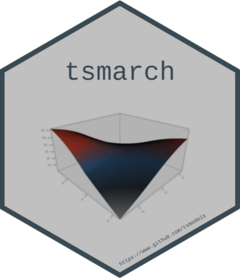

# tsmarch 

[](/commits/master)
[](commits/master)
[](https://cran.r-project.org/package=tsmarch)

# tmgarch

The `tsmarch` package represents a re-write and re-think of the models
in [rmgarch](https://CRAN.R-project.org/package=rmgarch). It is written
using simpler S3 methods and classes, has a cleaner code base, extensive
documentation and unit tests, provides speed gains by making use of
parallelization in both R (via the `future` package) and in the C++ code
(via `RcppParallel` package), and works with the new univariate GARCH
package [tsgarch](https://CRAN.R-project.org/package=tsgarch).

## Installation

The package can be installed from CRAN or the
[tsmodels](github.com/tsmodels/) github repo:

``` r
remotes::install_github("tsmodels/tsmarch", dependencies = TRUE)
```
