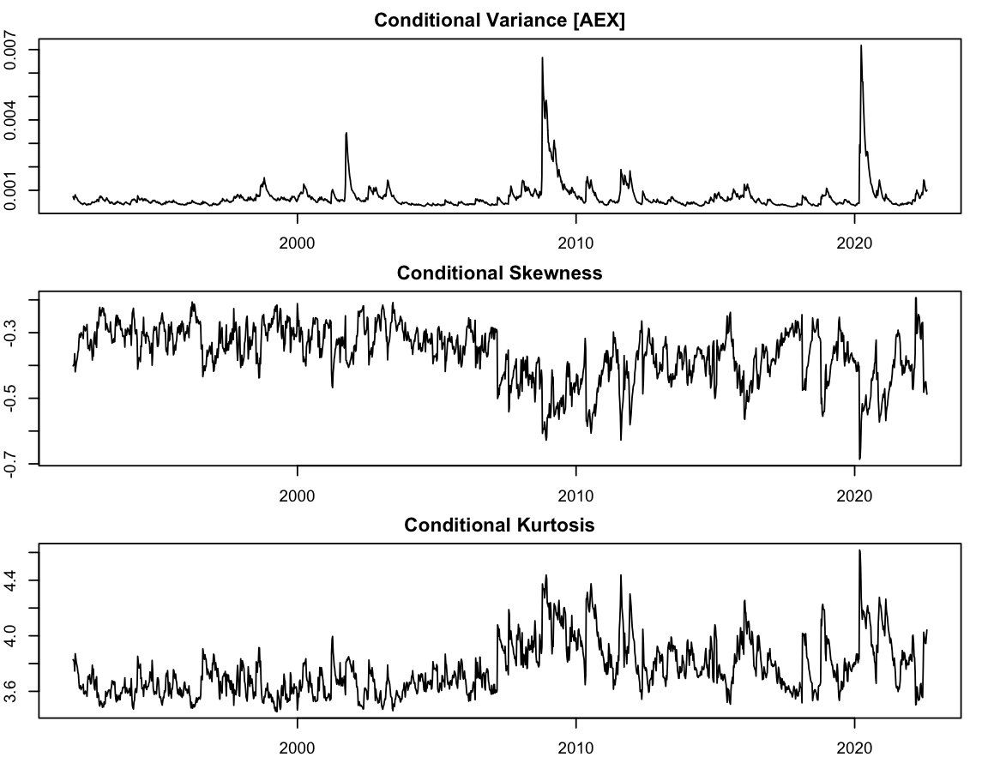

```{r setup, include = FALSE}
knitr::opts_chunk$set(
  collapse = TRUE,
  comment = "#>"
)
```

# Model Specification and Estimation

All models in the `tsmarch` package assume as input a zero-mean time series of returns, 
which means that conditional mean filtration should be performed outside the package.
However, all methods provide an argument to pass the already estimated conditional
mean (`cond_mean`) which takes care of the conditional distribution centering, 
particularly during the prediction step.


```{r,highlight=TRUE}
suppressMessages(library(tsmarch))
suppressMessages(library(xts))
data(globalindices)
insample <- 1:1560
onlinefilter <- 1561:1600
outsample <- 1601:1698
series <- 1:10
y <- as.xts(globalindices[insample, series])
arima_mod <- lapply(series, function(i){
    arima(y[insample, i], order = c(6, 0, 0))
})
.residuals <- do.call(cbind, lapply(arima_mod, function(x) as.numeric(residuals(x))))
.fitted <- coredata(y[insample, series]) - .residuals
.residuals <- xts(.residuals, order.by = index(y[insample, series]))
.fitted <- xts(.fitted, order.by = index(y[insample, series]))
colnames(.residuals) <- colnames(.fitted) <- colnames(y[,series])
spec <- gogarch_modelspec(.residuals, distribution = "nig", model = "garch", components = 5, cond_mean = .fitted)
mod <- estimate(spec)
```

In the code snippet above we first estimated an AR(6) for each of the series, but any
model could be used. The residuals of the series are passed as the main input into the
specification object whilst the fitted values are (optionally) passed to 
the `cond_mean` argument and saved in the object. We use dimensionality reduction 
in the whitening stage with the `components` argument. The returned object is of 
class `r class(mod)` from which we can then proceed to further analyze the series.


# Filtering

Online filtering of new data with the existing estimated model can be achieved
via the `tsfilter` method which returns an object of class  `r class(mod)` 
updated with the new information. What this allows us to do is to use the existing
estimated model in order to filter newly arrived information without having to
re-estimate. Since the returned object is the same as the estimated object, we
can then use the existing methods to analyze the new data.

```{r}
new_y <- as.xts(globalindices[onlinefilter, series])

arima_mod <- lapply(series, function(i){
    fixed_pars <- coef(arima_mod[[i]])
    arima(rbind(y[,i], new_y[,i]), order = c(6, 0, 0), fixed = fixed_pars)
})
.residuals <- do.call(cbind, lapply(arima_mod, function(x) as.numeric(residuals(x))))
.fitted <- coredata(rbind(y, new_y)) - .residuals
.residuals <- xts(.residuals, order.by = index(rbind(y, new_y)))
.fitted <- xts(.fitted, order.by = index(rbind(y, new_y)))
colnames(.residuals) <- colnames(.fitted) <- colnames(y)
.new_residuals <- .residuals[onlinefilter,]
.new_fitted <- .fitted[onlinefilter,]
mod_filtered <- tsfilter(mod, y = .new_residuals, cond_mean = .new_fitted)
```

We perform a quick check that the filtering has been successful by comparing the
filtered covariance matrix with the estimated covariance matrix for the old data.

```{r}
old_cov <- tscov(mod)
new_cov <- tscov(mod_filtered)
all.equal(as.numeric(old_cov), as.numeric(new_cov[,,insample]))
```

# Conditional Co-moments

There are 3 methods related to the conditional co-moments of the model: `tscov` (and `tscor`)
returns the `NxNxT` conditional covariance (correlation) matrix, 
`tscoskew` returns the `NxNxNxT` conditional coskewewness matrix and `tscokurt`
returns the `NxNxNxNxT` conditional cokurtosis matrix. These methods benefit
from the use of multiple threads which can be set via 
the `RcppParallel::setThreadOptions` function (though care should be taken about
availability of RAM).

```{r}
V <- tscov(mod_filtered)
S <- tscoskew(mod_filtered, standardized = TRUE, folded = TRUE)
K <- tscokurt(mod_filtered, standardized = TRUE, folded = TRUE)
```

Notice that the `standardized` and `folded` arguments are used to return the standardized
co-moments in either folded or unfolded form. The unfolded form represented the flattened
tensor of the co-moments is useful for the calculation of the portfolio weighted moments
via the kronecker product.

```{r,echo=TRUE,eval=FALSE}
par(mfrow = c(3, 1), mar = c(2,2,2,2))
plot(index(.residuals), V[1,1,], type = "l", main = "Conditional Variance [AEX]")
plot(index(.residuals), S[1,1,1, ], type = "l", main = "Conditional Skewness")
plot(index(.residuals), K[1,1,1,1,], type = "l", main = "Conditional Kurtosis")
```


```{r,out.width="100%",echo = FALSE}

```

# Prediction

